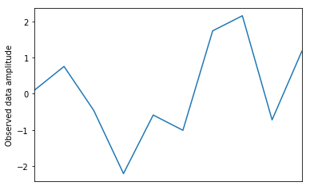
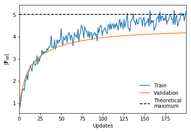
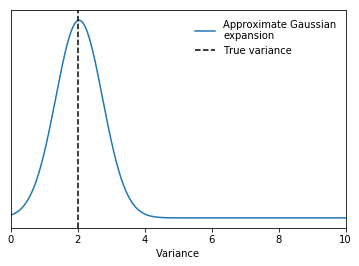

# Design document for LFI Engine

## Objective

Provide a simple and efficient framework for performing Likelihood-Free Inference
on top of a probabilistic programing language.

## Related work

Related projects can be broken down in two classes, generic inference frameworks
and LFI implementations.

Inference frameworks:
  - [PyMC3](https://docs.pymc.io/) provides both intuitive syntax for defining a
  model, and set of inference algorithms (NUTS, ADVI). Theano based.
  - [Pyro](http://pyro.ai/)

TODO LFI engines:


## Design overview

1. Framework should remain lightweight, sticking as much as possible to existing
  conventions and tools from most closely related back-end PPL.

### Example 1: Simple ABC on a given model


### Example 3: Using IMNN compression

```python
import tensorflow as tf
from engine.compression import IMNN
```

I think we might need to include a simulator wrapper which contains simulators, batch simulators, simulators for derivatives, etc...

At the moment I have set up the IMNN to work with a simulator object which will simulate, do a batch of simulations and will calculate simulations for numerical derivatives. It will also work with simulator which returns a simulation, derivative pair.

```python
class simulator(object):
    import numpy as np
    def simulate(self, Σ, seed=None):
        if seed is not None:
            np.random.seed(seed)
        d = np.random.normal(0., np.sqrt(Σ), (10,))

        if seed is not None:
            np.random.seed()
        return d

    def batch_simulate(self, Σ, num_sims, seed=None):
        if seed is not None:
            np.random.seed(seed)
        d = np.random.normal(0., np.sqrt(Σ), (num_sims, 10))
        if seed is not None:
            np.random.seed()
        return d

    def batch_get_derivatives(self, central, h, num_sims, seed=None):
        if seed is None:
            seed = np.random.randint(int(1e6))
        dp = self.batch_simulate(central + h, num_sims, seed)[:, np.newaxis, :]
        dm = self.batch_simulate(central - h, num_sims, seed)[:, np.newaxis, :]
        return dp, dm
```

We define our simulator and _create_ our _observed data_. We're going to generate the real data with a variance of $\Sigma=2$, but we're going to make the fiducial parameter values $\Sigma^\textrm{fid}=1$.
```python
noise_simulator = simulator()
observed_data = noise_simulator.simulate(2.)
fiducial = np.array([1])
```


Next we set up the IMNN network, this can now be any form, but is easiest in Keras (dare I say it...)
```python
imnn_network = tf.keras.Sequential([
    tf.keras.layers.Dense(128, activation="relu", input_shape=(10,)),
    tf.keras.layers.Dense(128, activation="relu"),
    tf.keras.layers.Dense(1)
])
```

Now we can initialise the IMNN

```python
imnn = IMNN.IMNN(model=imnn_network, fiducial=fiducial)
```

We obviously need to generate some training data. We can currently do this two ways, either to generate the data yourself and load it into the IMNN or to get the IMNN to generate it. The first option would work something like
```python
d = noise_simulator.batch_simulate(Σ=fiducial, num_sims=3000)
dt = np.array([0.2])
dp, dm = noise_simulator.batch_get_derivatives(central=fiducial, h=dt/2, num_sims=300)

imnn.load_dataset(n_s=1000, n_p=100, d=d.astype(np.float32), dm=dm.astype(np.float32), dp=dp.astype(np.float32), dt=dt)
```
Perhaps more elegantly though we could simply use
```python
imnn.generate_dataset(simulator=noise_simulator, n_s=1000, n_p=100, n_fid=2000, n_der=2000, h=np.array([0.1]))
```

Now all we need is an optimiser for the IMNN training
```python
optimiser = tf.optimizers.SGD()
```

And finally we can train the IMNN
```python
imnn.fit(optimiser=optimiser, lam=2., updates=100)
```


The training is a little crude at the moment and I think that something much nicer could be done with the way that data is fed into the network for training. Also I've not yet implemented tf.while_loop() training for backpropagation when the simulations are huge. It's on my to-do list.

A bunch of useful things are saved as Tensor/numpy values at the end of the training including covariance, Fisher information matrix and the Fisher forecasts. Using this we can get a maximum likelihood estimator for our observed data and plot the approximate Gaussian expansion of the likelihood (I'm going to use scipy to be quick about it)...

```python
from scipy.stats import multivariate_normal
x = np.linspace(0, 10, 1000)
approx_dist = multivariate_normal.pdf(x, imnn.MLE(np.array([observed_data])), imnn.forecast)
```


Finally, to make the compression part of the LFI model we just use
```python
def model():
    Σ = lfi.Normal()
    data = simulator.simulate(np.sqrt(Σ))
    return imnn.summary(data)
```

Ta-dah!

## Detailed design
